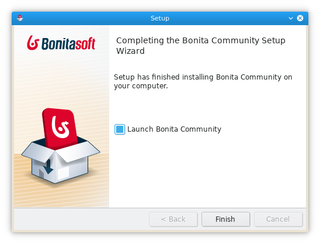
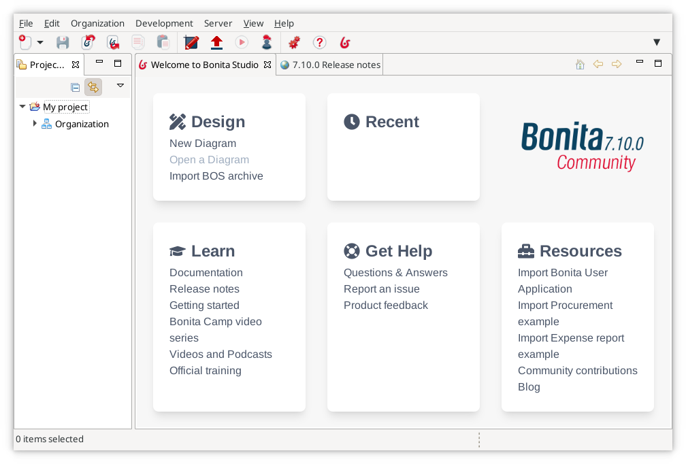
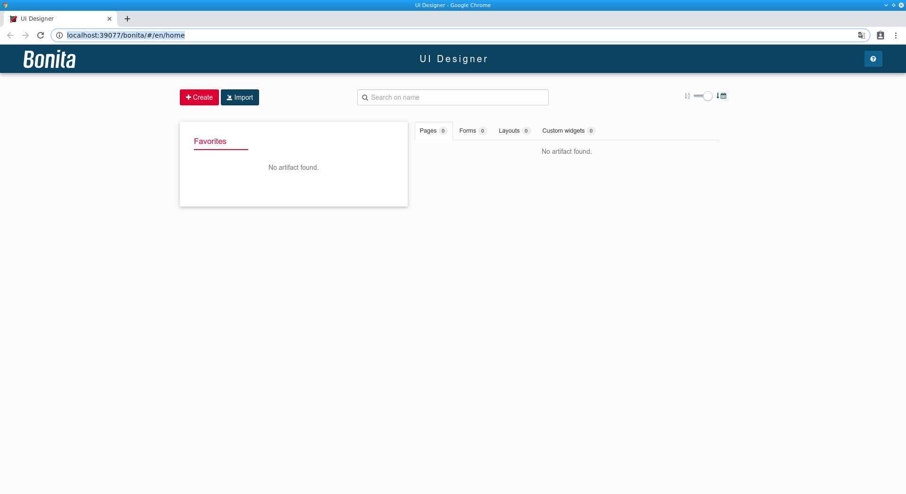

# Installation de Bonita Studio

La première étape de ce tutoriel de démarrage consiste à configurer votre environnement de développement. Il vous suffit d'installer Bonita Studio.

> ℹ info :  
> Si vous rencontrez des difficultés dans ce tutoriel de démarrage, veuillez [demander l'aide de la communauté Bonita](https://community.bonitasoft.com/questions-and-answers) et/ou ouvrir une question sur l'outil de [gestion de bugs](https://bonita.atlassian.net/projects/BBPMC/issues) de la communauté.

## Télécharger Bonita Studio

Pour télécharger la dernière version de Bonita Studio, ouvrez la [page de téléchargement](https://fr.bonitasoft.com/telechargez) et cliquez sur le bouton **Téléchargement**. Vous lancerez ainsi le téléchargement du programme d'installation de Bonita Studio pour votre système d'exploitation.

Lorsque le téléchargement est terminé, vous devez avoir l'un des fichiers suivants sur votre ordinateur (x.y.z renvoie à la version de Bonita Studio, par exemple 7.10.3) :
- Windows : « BonitaStudioCommunity-x.y.z-x86_64.exe »
- macOS : « BonitaStudioCommunity-x.y.z-x86_64.dmg »
- Linux : « BonitaStudioCommunity-x.y.z-x86_64.run »

Vous êtes maintenant prêt(e) à démarrer le processus d'installation.

## Installer Bonita Studio

Pour exécuter le programme d'installation pour Windows, macOS ou Linux, double-cliquez sur le fichier que vous avez téléchargé.

Le programme d'installation vous guidera tout au long de la configuration de l'installation très basique :
1. Sélectionnez la langue d'installation : elle sera utilisée pour le processus d'installation
1. Message d'accueil : cliquez sur le bouton **Suivant**
1. Licence d'utilisation : vous devez l'accepter pour continuer
1. Répertoire d'installation : conservez le répertoire par défaut 
1. Confirmation que l'installation va démarrer : cliquer sur le bouton **Suivant**
1. Installation en cours : patientez
1. Vous recevez un message de confirmation qui offre la possibilité de lancer Bonita Studio. Choisissez de lancer Bonita Studio et cliquez sur le bouton **Terminer**
1. Une page « Thank you for installing Bonita » s'affichera dans votre navigateur web. Vous pouvez la fermer

<!--{.img-responsive .img-thumbnail}-->

Bonita Studio est maintenant installé. Les dossiers d'installation par défaut sont :
- Windows : « C:\BonitaStudioCommunity-x.y.z »
- macOS : « /Applications/BonitaStudioCommunity-x.y.z »
- Linux : « /home/<username>/BonitaStudioCommunity-x.y.z »

## Première exécution de Bonita Studio

À ce stade, Bonita Studio doit s'exécuter sur votre ordinateur. Dans le cas contraire, vous pouvez le lancer manuellement en utilisant le raccourci installé ou le fichier exécutable de Bonita Studio à partir du dossier d'installation.

La page d'accueil de Bonita Studio doit s'afficher :

<!--{.img-responsive .img-thumbnail}-->

> ℹ info :  
> Lorsque Bonita Studio se lance, différentes tâches sont exécutées en arrière-plan telles que le démarrage du serveur de test de Bonita intégré (incluant l'initialisation du moteur Bonita), le déploiement de l'organisation test de Bonita, etc.
> 
> Cela peut prendre du temps et peut expliquer pourquoi certaines fonctionnalités ne sont pas disponibles immédiatement.

## Validation de l'installation

Afin de vérifier que tout est installé correctement, cliquez sur le bouton **Portail**  dans la barre d'outils. La page d'accueil du Portail Bonita s'ouvre alors dans votre navigateur web :

<!--{.img-responsive .img-thumbnail}-->

Cliquez sur le bouton **UI Designer**  dans la barre d'outils. Une fenêtre contextuelle s'affiche, vous pouvez l'ignorer :

<!--{.img-responsive .img-thumbnail}-->

L'éditeur d'interface utilisateur (UI Designer) doit s'ouvrir dans votre navigateur web :

<!--{.img-responsive .img-thumbnail}-->

## Prêt à démarrer

Bonita Studio est maintenant installé avec succès, et les outils et l'environnement de test sont prêts à fonctionner.
Vous êtes prêt(e) à passer au chapitre suivant et à [commencer à créer votre premier processus](draw-bpmn-diagram.md).
