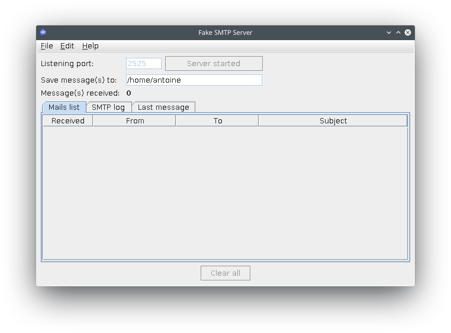

# Configurer un connecteur d'e-mail

Pour qu'un processus interagisse avec des systèmes externes tels que la publication d'un document sur un CMS, l'appel d'un API REST ou l'envoi d'un e-mail, Bonita fournit des connecteurs. Dans notre exemple, nous allons configurer un connecteur d'e-mail pour informer le responsable qu'une tâche _Deal with unsatisfied customer_ requiert son attention.

::: info
Un connecteur est un morceau de code exécuté au début ou à la fin d'un processus ou d'une tâche. Il traite les données d'entrée (par exemple, les valeurs des variables métier) et génère (en option) certaines sorties. Le code du connecteur peut uniquement transformer des entrées, mais peut également exécuter une interaction avec des systèmes externes.
:::

Afin d'éviter les paramètres qui sont spécifiques au vrai fournisseur d'e-mail, nous allons utiliser un outil pour un faux serveur d'e-mail « FakeSMTP » :
1. Téléchargez FakeSMTP à partir de ce lien : [http://nilhcem.github.com/FakeSMTP/downloads/fakeSMTP-latest.zip](http://nilhcem.github.com/FakeSMTP/downloads/fakeSMTP-latest.zip)
1. Décompressez le fichier
1. Exécutez FakeSMTP en double-cliquant sur le fichier JAR ou en exécutant cette commande shell : « java -jar fakeSMTP-2.0.jar »
1. Lorsque l'interface utilisateur s'affiche, paramétrez le**listening port** sur _2525_
1. Cliquez sur le bouton **Start server**.

   <!--{.img-responsive .img-thumbnail}-->

Maintenant que nous avons exécuté un faux serveur, configurons le connecteur d'e-mail sur la tâche _Deal with unsatisfied customer_ :
1. Sélectionnez la tâche _Deal with unsatisfied customer_
1. Allez dans **Execution > Connectors in**
1. Cliquez sur le bouton **Add...**
1. Sélectionnez le connecteur _Email (SMTP)_
1. Cliquez sur le bouton **Next**
1. Nommez la configuration du connecteur _Send notification_
1. Cliquez sur le bouton **Next**
1. Définissez les valeurs des paramètres suivantes :
   - SMTP host : _localhost_
   - SMTP port : _2525_ (le numéro de port spécifié dans FakeSMTP)
   - SSL (dans la section **Security**) : _unchecked_
1. Cliquez sur le bouton **Next**
1. Saisissez _no-reply@acme.com_ dans le champ **From** 
1. Utilisez l'icône  pour modifier l'expression du champ **To** 
1. Définissez **Expression type** sur **Script**
1. Collez le script Groovy suivant dans la zone de modification du code : `BonitaUsers.getUserProfessionalContactInfo(apiAccessor,taskAssigneeId).email`
1. Cliquez sur le bouton **OK**
1. Cliquez sur le bouton **Next**
1. Définissez _You have a pending task_ comme objet
1. Cliquez sur **Finish**

   <!--{.img-responsive .img-thumbnail}-->

Si vous exécutez le processus avec le connecteur configuré, vous devez voir un nouvel e-mail entrant dans l'interface utilisateur FakeSMTP lorsque la tâche _Deal with unsatisfied customer_ est disponible.

Vous avez maintenant une définition de processus qui utilise une large palette de fonctionnalités de Bonita. Dans les [chapitres suivants](design-application-page.md), nous allons créer une application sur ce processus.
