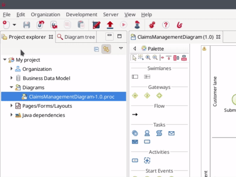
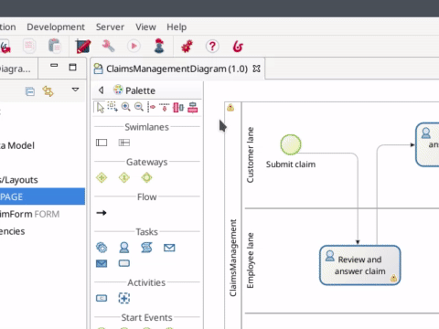
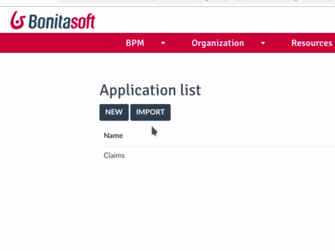

# Créer une application

La création de l'application est l'étape finale de ce tutoriel de démarrage.

Mais avant de créer réellement l'application, nous devons déployer notre page d'application dans le Portail Bonita :
1. Dans le menu Bonita Studio, cliquez sur **File > Deploy**
1. Cliquez sur le bouton **Select all** pour être certain(e) de tout déployer : organisation test, modèle de données métier, définition de processus, page d'application
1. Vérifiez que la case **Clean BDM database before deployment** n'est pas cochée, car nous souhaitons conserver nos données pour le test
1. Cliquez sur le bouton **Deploy**
1. Dans la fenêtre contextuelle **Deploy status**, cliquez sur le bouton **Close**

   <!--{.img-responsive .img-thumbnail}-->

À présent, nous sommes prêts à créer réellement l'application. Dans la Bonita Community Edition, le moyen le plus simple de créer une application est d'utiliser le Portail Bonita :
1. Cliquez sur l'icône du Portail  dans la barre d'outils de Bonita Studio
1. Dans l'angle supérieur droit de la fenêtre, cliquez sur le menu déroulant **User**
1. Sélectionnez **Administrator**
1. Cliquez sur l'onglet **Applications**
1. Cliquez sur le bouton **New**
1. Configurez l'application :
   - Display name : _Claims_
   - URL : _claims_
   - Version : _1.0_
   - Profile : _User_
   - Description : _Claims management application_
1. Cliquez sur le bouton **Create**

   <!--{.img-responsive .img-thumbnail}-->

Vous devez maintenant modifier l'application pour ajouter la page d'application créée précédemment :
1. Cliquez sur l'icône **...** dans la colonne **Actions** 
1. Dans la section **Pages**, cliquez sur le bouton **Add**
1. Dans la liste déroulante, sélectionnez _custompage_claimsList - claimsList_
1. Dans **URL** saisissez : _claims-list_
1. Cliquez sur le bouton **Add**
1. Dans la liste des pages, cliquez sur **home icon** pour définir claims-list comme page d'accueil et supprimer l'accueil par défaut
1. Nous avons créé une application très simple, avec une seule page, nous n'avons donc pas besoin de définir un menu de navigation

   <!--{.img-responsive .img-thumbnail}-->

Vous pouvez maintenant cliquer sur l'URL de l'application et vous verrez la page d'application s'afficher dans le format d'application par défaut.

Félicitations ! Vous avez créé avec succès votre premier processus et votre première application avec Bonita.

Si vous souhaitez en savoir plus sur les composants et les concepts de Bonita, nous vous recommandons le [Tutoriel Bonita Camp](https://www.youtube.com/playlist?list=PLvvoQatxaHOMHRiP7hFayNXTJNdxIEiYp). Bien sûr la [documentation officielle](https://documentation.bonitasoft.com) est également l'outil idéal pour en apprendre plus sur Bonita. Si vous préférez apprendre à l'aide d'exemples, vous en trouverez plusieurs sur le [site web de la communauté](https://community.bonitasoft.com/project?title=&field_type_tid=3869). Et enfin, n'oubliez pas que vous pouvez toujours demander de l'aide et [poser des questions à la communauté Bonita](https://community.bonitasoft.com/questions-and-answers/).
