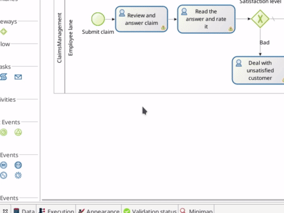

# Créer des interfaces utilisateur web (formulaires)

L'utilisateur pilote généralement l'exécution du processus via des interfaces web. Bonita fournit une solution, l'éditeur d'interface utilisateur (UI Designer) pour créer facilement ces interfaces.

::: info
Le workflow standard serait :
- De créer le Modèle de Données Métier
- D'ajouter des variables métier dans la définition du processus
- De générer des contrats basés sur les variables métier
- De générer des formulaires Bonita basés sur les contrats

Étant donné que nous avons déjà exécuté les trois premières étapes, il est maintenant temps de créer les formulaires.
:::

Commencer par le formulaire d'instanciation de processus :
1. Sélectionnez le pool de processus
1. Allez dans **Execution > Instantiation form**
1. Cliquez sur l'icône du crayon à côté de **Target form**. Un nouveau formulaire basé sur le contrat est créé (si le formulaire n'existe pas déjà) et UI Designer s'ouvre dans votre navigateur web
1. Renommez le formulaire _newForm_ en _submitClaimForm_
1. Cliquez sur le bouton **Save** pour enregistrer le formulaire sous son nouveau nom

   <!--{.img-responsive .img-thumbnail}-->

Vous pouvez personnaliser l'aspect du formulaire. Par exemple, vous pouvez passer d'un widget d'une ligne de texte à une zone de texte :
1. Sélectionnez le widget _Description_ en cliquant dessus
1. Dans **Widget properties**, à droite de la fenêtre, cliquez sur l'icône **...** et sélectionnez **Switch...**
1. Dans la liste déroulante, sélectionnez **Text Area**
1. Cliquez sur le bouton **Show properties**
1. Cliquez sur le bouton **Switch**
1. Cliquez sur le bouton **Save** pour enregistrer vos modifications

   <!--{.img-responsive .img-thumbnail}-->

Vous pouvez maintenant retourner dans Bonita Studio et créer le formulaire pour la tâche utilisateur  _Review and answer claim_ :
1. Sélectionnez la tâche
1. Allez dans **Execution > Form**
1. Cliquez sur l'icône du crayon à côté de **Target form**. Un nouveau formulaire basé sur le contrat est créé (si le formulaire n'existe pas déjà) et UI Designer s'ouvre dans votre navigateur web
1. Répondez **Yes** à la question. Vous incluez ainsi des widgets pour afficher tous les attributs de la variable métier dans le formulaire
1. Renommez le formulaire _newForm_ en _reviewAndAnswerForm_
1. Sélectionnez le widget _Satisfaction Level_ et utilisez la touche de suppression pour le supprimer, car nous n'en voulons pas dans ce formulaire
1. Cliquez sur le bouton **Save** pour enregistrer vos modifications

Effectuez les mêms opérations avec le formulaire pour la tâche _Read the answer and rate it_ :
1. Définissez le nom du formulaire sur _readAnswerAndRateItForm_
1. Ne supprimez aucun widget, car nous souhaitons afficher la description de la réclamation et la réponse et permettre à l'utilisateur de donner un niveau de satisfaction

Vous pouvez maintenant exécuter cette nouvelle version du processus. Vous verrez que le formulaire vous offre toujours la possibilité de saisir les données requises par le contrat, mais affiche également les données fournies au début du processus ou dans les étapes précédentes.

Dans le [chapitre suivant](define-who-can-do-what.md), vous pouvez veiller à ce que les tâches soient exécutables uniquement par les utilisateurs appropriés.
