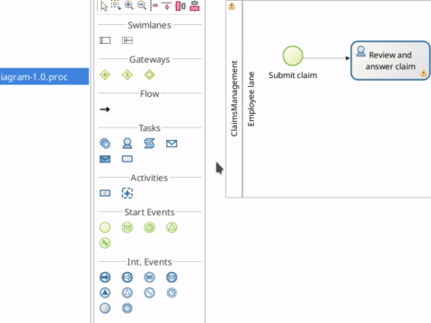
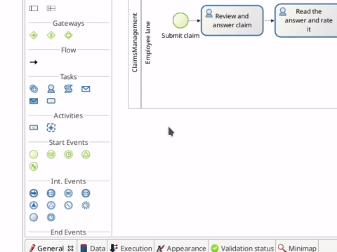
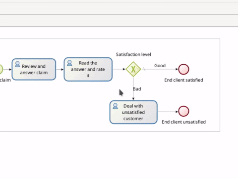

# Déclarer les variables métier 

Pour que votre processus puisse exécuter des opérations sur les données métier telles que les opérations classiques créer, lire, mettre à jour et supprimer, vous devez inclure des variables métier dans votre définition de processus.

Dans notre processus, nous allons traiter un seul objet : une réclamation. L'objet réclamation stockera des informations sur la réclamation elle-même (c'est-à-dire sa description), la réponse fournie et un niveau de satisfaction. Pour déclarer une variable métier :
1. Sélectionnez le pool de processus, le rectangle qui inclut les événements de début et les tâches.

   <!--{.img-responsive .img-thumbnail}-->

1. En bas de l'écran de Bonita Studio, allez dans **Data > Pool variables**
1. Cliquez sur le bouton **Add...** à côté de **Business variables**
1. Saisissez le nom de la variable métier : _claim_ (en minuscule)
1. Sélectionnez le **Business Object**: _com.company.model.Claim_
1. Cliquez sur le bouton **Finish**

   <!--{.img-responsive .img-thumbnail}-->

Maintenant qu'une variable métier est déclarée, nous pouvons l'utiliser dans notre définition de condition de transition :
1. Sélectionnez la transition connectant la porte _Satisfaction level_ avec _Deal with unsatisfied customer_
1. Allez dans l'onglet **General > General**
1. Dans **condition**, cliquez sur l'icône du crayon
1. Sélectionnez **Script** dans **Expression type** à gauche de la fenêtre contextuelle
1. Saisissez le script Groovy : `claim.satisfactionLevel < 3`
1. Cliquez sur le bouton **OK**

   <!--{.img-responsive .img-thumbnail}-->

::: info
Le script configuré pour la condition de transition retournera « true » si le niveau de satisfaction donné est inférieur à 3, comme la transition vers _Deal with unsatisfied customer_ sera activée.
:::

::: info
Notre variable métier n'est jamais initialisée, donc elle restera vide. Il existe plusieurs options différentes pour initialiser une variable métier :
- valeur par défaut de la variable métier
- opération sur une tâche
- sortie de connecteur

Nous utiliserons la première et deuxième option dans les chapitres suivants.
:::

À ce stade de la définition de processus, si vous essayez de l'exécuter, vous ne verrez aucune différence dans le formulaire d'instanciation de processus et dans les formulaires des tâches utilisateur. Seul le formulaire de l'aperçu du processus est différent : il répertorie désormais la variable métier mais sans valeur associée.

Vous êtes maintenant prêt(e) à passer au [chapitre suivant](declare-contracts.md) et à commencer à collecter des entrées utilisateur à partir des formulaires. Elles passeront par les [contrats](declare-contracts.md) et pourront finalement être stockées dans les variables métier.
