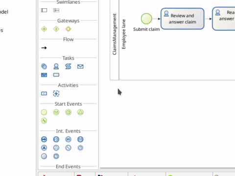
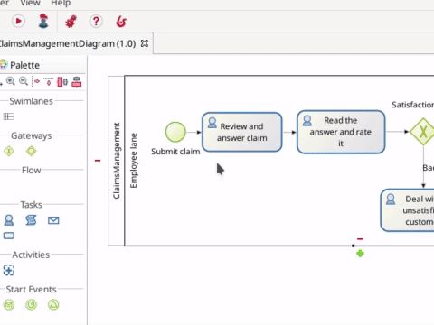

# Déclarer des contrats

Jusqu'ici, notre processus définit une séquence d'événements et de tâches et déclare une variable métier qu'il va instancier et mettre à jour une fois exécutée. Nous souhaitons instancier notre variable métier « claim » en utilisant la description fournie par le client lorsqu'il lance le processus. Nous devons également mettre à jour la réclamation avec la réponse fournie par l'employé et avec la note de satisfaction donnée par le client. Nous avons besoin d'un moyen de collecter des informations auprès de l'utilisateur et de les stocker dans la variable métier. Pour ce faire, nous utilisons les interfaces utilisateur (formulaires web par défaut dans Bonita) ainsi qu'un autre concept : le contrat.

Un contrat définit les données attendues de l'utilisateur pour démarrer un processus (contrat d'instanciation) ou pour exécuter une tâche utilisateur (contrat de tâche). Par défaut, Bonita offre une solution pour construire facilement des formulaires (consultez le chapitre suivant) permettant à l'utilisateur de visualiser et de fournir des données. Lorsqu'ils sont soumis, les formulaires demandent au moteur Bonita de lancer un processus ou d'exécuter une tâche en utilisant les données fournies qui doivent correspondre à ce qui est attendu par le contrat.

Étant donné que nos informations relatives au contrat seront utilisées pour définir les valeurs des variables métier, nous pouvons utiliser un assistant qui générera le contrat en se fondant sur la variable métier. Cet assistant définit la valeur par défaut de la variable métier et génère l'exécution de la tâche.

Créer le contrat pour l'instanciation de processus :
1. Sélectionnez le pool de processus
1. En bas de la fenêtre de Bonita Studio, allez dans l'onglet **Execution > Contract > Inputs**
1. Cliquez sur le bouton **Add from data...**
1. Laissez les options par défaut cochées (_Business variable_, _Instantiate_, _claim_, _claimInput_)
1. Cliquez sur le bouton **Next**
1. Sélectionnez uniquement la _description_ (décochez _answer_, _satisfactionLevel_)
1. Cliquez sur **Finish**
1. Vous pouvez ignorer le message d'information et cliquer sur le bouton **OK**

   <!--{.img-responsive .img-thumbnail}-->

::: info
Vous avez maintenant un contrat nommé _claimedInput_ de type « COMPLEXE » avec un attribut, _description_ de type « TEXTE ». Comme la description est obligatoire, vous pouvez voir dans l'onglet **Execution > Contract > Constraints** qu'une règle de validation a été créée pour s'assurer d'obtenir une valeur pour la description. Enfin, si vous éditez la variable métier _claim_, vous constatez qu'un script a été généré pour vous permettre de définir la valeur par défaut de la variable. La définition de cette valeur déclenchera une insertion dans la table « CLAIM » créée pour vous dans la base de données des données métier gérée par Bonita.
:::

À présent, créons le contrat pour la tâche utilisateur _Review and answer claim_ :
1. Sélectionnez la tâche _Review and answer claim_
1. En bas de la fenêtre de Bonita Studio, allez dans l'onglet **Execution > Contract > Inputs**
1. Cliquez sur le bouton **Add from data...**
1. Sélectionnez Data : _Business variable_, Action : _Edit_, et conservez les valeurs par défaut des autres options
1. Cliquez sur le bouton **Next**
1. Sélectionnez uniquement _answer_ (décochez _description_, _satisfactionLevel_)
1. Cliquez sur le bouton **Finish**
1. Vous pouvez ignorer les messages d'information et d'avertissement et cliquer sur le bouton **OK**

   <!--{.img-responsive .img-thumbnail}-->

::: info
Nous avons maintenant un contrat pour l'étape. Ce contrat ne crée pas de nouvelle réclamation, mais met à jour un attribut de la réclamation (la réclamation est créée lorsque nous lançons le processus). La mise à jour de l'attribut est effectuée par une opération (générée pour vous) sur la tâche. Sélectionnez **Execution > Operations** pour afficher l'opération qui met à jour l'attribut _answer_.
:::

Créer le contrat pour la tâche _Read the answer and rate it_ :
1. Procédez exactement de la même manière que pour la tâche _Review and answer claim_ 
1. Sélectionnez _satisfactionLevel_ comme attribut à utiliser dans le contrat

À présent, vous pouvez cliquer sur le bouton **Run** de Bonita Studio pour déployer et exécuter cette version mise à jour. Vous obtenez des formulaires générés automatiquement fondés sur le contrat. Dans le formulaire d'aperçu, vous verrez les données stockées dans la variable métier. Notez qu'un formulaire n'affichera pas les données saisies précédemment. Nous aborderons ce sujet dans le [chapitre suivant](create-web-user-interfaces.md).
