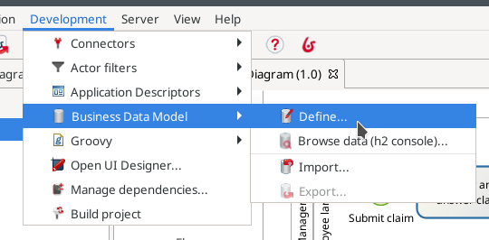

# Définir le Modèle de Données Métier (Business Data Model - BDM)

La plateforme Bonita offre un moyen de définir, manipuler et stocker vos données métier. Ce service de gestion des données crée des objets Java pour autoriser la manipulation de données, des tables de base de données pour le stockage et toutes les opérations requises pour stocker les données de votre processus dans la base de données et vice versa.

La gestion de données implique plusieurs étapes :
- Créer le Modèle de Données Métier (BDM). Il s'agit de la définition des types de données que vous utiliserez dans vos processus et applications.
- Déclarer des variables métier dans la définition de processus. Les variables sont utilisées pour établir le lien entre votre définition de processus et les données dont elle a besoin pour les créer, lire, mettre à jour et supprimer. Les données peuvent être créées dans le cadre de l'exécution du processus (au démarrage ou lors d'une tâche), mais les processus peuvent également lire et mettre à jour des données créées par d'autres processus et bien sûr peuvent choisir de supprimer des données.
- Définir des contrats de processus et de tâche. Les contrats définissent les informations que le processus accepte de la part de l'utilisateur qui soumet le formulaire.

Dans ce chapitre, nous nous concentrerons uniquement sur la création du Modèle de Données Métier (BDM). La déclaration des variables métier sera traitée dans le chapitre suivant.

Dans Bonita Studio, créer un BDM :
1. Allez dans le menu **Développement > Modèle de Données Métier > Définir...**

  <!--{.img-responsive .img-thumbnail}-->
  
1. Cliquez sur le bouton **Nouvel Objet Métier**
1. Saisissez le nom d'objet _Claim_ (les noms d'objet doivent toujours commencer par une majuscule)
1. Dans l'onglet **Attributs**, cliquez sur le bouton **Ajouter**
1. Ajoutez 3 attributs (les noms d'attribut doivent toujours commencer par une minuscule) :
  1. _description_ de type _STRING_ et _obligatoire_ (cochez la case dans la colonne **Obligatoire**)
  1. _answer_ de type _STRING_, _optionnel_
  1. _satisfactionLevel_ de type _INTEGER_, _optionnel_
  
  <!--{.img-responsive .img-thumbnail}-->
  
1. Cliquez sur le bouton **Terminer**

> ? info :  
> **Obligatoire** pour l'attribut d'un objet signifie que l'objet ne peut pas être créé avec une valeur vide. Si l'option **obligatoire** n'est pas cochée, cela signifie qu'un objet peut être créé avec une valeur vide, pour l'attribut « facultatif ». Dans notre exemple, l'attribut _answer_ est facultatif, car, au démarrage du processus, il sera vide. Plus loin dans l'exécution du processus, un employé fournira une réponse qui sera donc obligatoire (mais cela n'est pas imposé par la définition du BDM).

> ? avertissement ? :  
> Lorsque vous modifiez le BDM dans Bonita Studio, il est toujours recommandé de réinitialiser la base de données après avoir apporté une modification au modèle. Cochez la case « Reset BDM database », affichée dans la fenêtre contextuelle lorsque vos validez vos modifications.

> ? info :  
> Lorsque vous cliquez sur le bouton **Terminer**, trois opérations différentes sont exécutées :
> - La définition du BDM est enregistrée dans votre projet (dans la catégorie **Modèle de Données Métier**)
> - Les classes Java sont générées, compilées, packagées et le fichier jar qui en résulte est ajouté à votre projet (dans la catégorie **Dépendances Java**)
> - Les tables sont créées dans la base de données de test intégrée au Studio Bonita

> ? info :  
> Bonita Studio utilise h2 pour fournir la base de données à des fins de test. (Vous pouvez utiliser d'autres types de bases de données telles que Oracle, PostgreSQL, MySQL et SQL Server pour un environnement de production). Bonita Studio fournit deux schémas de base de données : un pour le moteur Bonita et un dédié au BDM. Vous pouvez afficher les tables créées dans la base de données BDM h2 en cliquant dans le menu de Bonita Studio sur **Développement > Modèle de Données Métier > Consulter les données (console h2)...**. Dans la console h2 (une interface web), vous pouvez voir qu'une table nommée « CLAIM » a été créée. Vous pouvez exécuter une requête SQL telle que `SELECT * FROM CLAIM` qui doit retourner un résultat vide, car il n'y a aucune donnée pour l'instant.

Vous disposez maintenant d'un modèle de gestion des données métier entièrement fonctionnel. Vous êtes prêt(e) à passer au chapitre suivant et à [commencer à renseigner la base de données avec les données collectées par le processus](declare-business-variables.md). 
