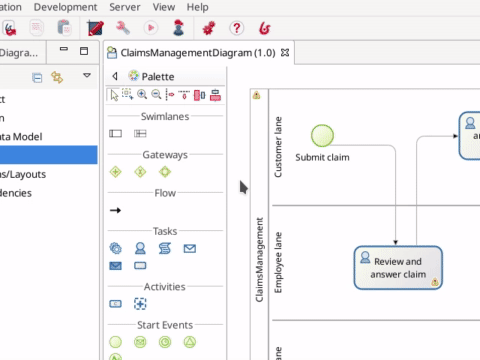

# Définir qui peut faire quoi

Jusqu'ici, lorsque vous exécutiez le processus, vous agissiez en tant qu'utilisateur unique (nom d'utilisateur : _walter.bates_, mot de passe : _bpm_) pouvant exécuter toutes les tâches utilisateur. Dans un scénario plus proche d'un cas d'utilisation réel, il existe différents types d'utilisateurs : des clients (pouvant soumettre des réclamations), des employés (qui répondent aux réclamations) et le responsable de l'utilisateur qui fournit la réponse (qui est nécessaire pour interagir avec des clients mécontents).

La première étape de la configuration de « qui peut faire quoi » consiste à créer des lanes dans notre pool. Nous avons déjà une lane par défaut pour les employés. Ajoutons-en une autre pour le client et une pour le responsable :
1. Dans Bonita Studio, depuis la palette à gauche du diagramme, sélectionnez l'icône **lane**
1. Cliquez à l'intérieur du pool de processus pour ajouter la lane. Faites-le deux fois pour avoir un total de trois lanes
1. Sélectionnez la lane _Employé (lane)_ et cliquez sur l'icône de la flèche en bas pour la déplacer afin qu'elle soit positionnée au centre

   <!--{.img-responsive .img-thumbnail}-->

1. Sélectionnez _Lane1_, allez dans l'onglet **Général > Lane** et renommez-la _Customer lane_
1. Sélectionnez _Lane2_, allez dans l'onglet **Général > Lane** et renommez-la _Manager lane_
1. Sélectionnez l'événement de début _Submit claim_ et déplacez-le (par glisser-déplacer) vers la _Customer lane_. Effectuez la même opération pour la tâche _Read the answer and rate it_
1. Sélectionnez la tâche _Deal with unsatisfied customer_ et déplacez-la vers la _Manager lane_. Effectuez la même opération pour l'événement de fin _End client unsatisfied_

   <!--{.img-responsive .img-thumbnail}-->

> ℹ info :  
> Une lane est utilisée pour regrouper les tâches utilisateur qui doivent être effectuées par le même ensemble d'utilisateurs.

À présent, nous devons définir des « acteurs », un pour chaque lane, et les associer à la lane à laquelle ils appartiennent :
1. Sélectionnez le pool
1. Allez dans **Général > Acteurs**
1. Cliquez sur le bouton **Ajouter**
1. Cliquez sur le nom par défaut de l'acteur (_Actor1_) et modifiez-le en : _Customer actor_
1. Répétez pour créer _Manager actor_
1. Sélectionnez le _Customer actor_ et cliquez sur le bouton **"Marquer" initiateur**. Un flag sera ajouté pour cet acteur afin de l'identifier comme celui qui démarre le processus

   <!--{.img-responsive .img-thumbnail}-->

1. Sélectionnez _Customer lane_ (cliquez sur le nom de la lane)
1. Allez dans **Général > Acteurs** et dans la liste déroulante, sélectionnez _Customer actor_
1. Effectuez la même opération pour la _Manager lane_ avec _Manager actor_

   <!--{.img-responsive .img-thumbnail}-->

Les acteurs sont simplement des identifiants. Afin de définir l'utilisateur réel, nous devons configurer les acteurs et les associer aux groupes, rôles, utilisateurs, etc. de l'organisation. Nous utiliserons l'organisation test Bonita Acme pour cet exemple :
1. Dans le menu Bonita Studio, cliquez sur **Serveur > Configurer** 
1. Sélectionnez _Employee actor_
1. Cliquez sur le bouton **Groupes...**
1. Décochez _/acme_
1. Cochez _/acme/production/services_. Nous utiliserons ce groupe d'utilisateurs pour jouer le rôle de l'équipe de support chargée de répondre aux réclamations. Dans l'organisation test, deux utilisateurs appartiennent à ce groupe : _mauro.zetticci_ et _thomas.wallis_. Le responsable des deux utilisateurs est : _michael.morrison_
1. Cliquez sur le bouton **Terminer**

   <!--{.img-responsive .img-thumbnail}-->

1. Sélectionnez _Customer actor_
1. Cliquez sur le bouton **Groupes...**
1. Cochez _/acme/hr_. Nous utiliserons ce groupe d'utilisateurs pour jouer le rôle des clients qui peuvent soumettre des réclamations. Dans l'organisation test, trois utilisateurs appartiennent à ce groupe : _walter.bates_, _helen.kelly_ et _april.sanchez_
1. Cliquez sur le bouton **Terminer**
1. Sélectionnez _Manager actor_
1. Cliquez sur le bouton **Rôles...**
1. Sélectionnez le rôle _member_. Tous les utilisateurs de l'organisation test ont ce rôle. Mais, cela n'a pas vraiment d'importance, car cette association d'acteur sera annulée plus tard dans notre configuration
1. Cliquez sur le bouton **Terminer**
1. Cliquez sur le bouton **Terminer** pour fermer la fenêtre de configuration

À ce stade, si vous essayez d'exécuter le processus, vous verrez que _walter.bates_ ne peut plus exécuter la tâche _Review and answer claim_. Vous devrez vous déconnecter du Portail Bonita (cliquez sur **Walter Bates** dans l'angle supérieur droit et sélectionnez **Déconnexion**) et vous connecter avec _mauro.zetticci_ ou _thomas.wallis_ (mot de passe : _bpm_) pour pouvoir afficher la tâche. Et vous devez vous reconnecter avec le compte _walter.bates_ pour pouvoir afficher la tâche qui vous permet de lire la réponse fournie.

Actuellement, la tâche _Read the answer and rate it_ est disponible pour tous les utilisateurs du groupe _/acme/hr_, mais elle devrait être disponible uniquement pour l'utilisateur qui a lancé le processus (_walter.bates_). De même, la tâche _Deal with unsatisfied customer_ sera disponible pour tous alors qu'elle devrait être disponible uniquement pour le responsable de l'utilisateur qui a exécuté la tâche _Review and answer claim_. Pour répondre à ce problème, nous configurerons des filtres pour les acteurs :
1. Sélectionnez la _Customer lane_
1. Allez dans **Général > Acteurs**
1. Cliquez sur le bouton **Définir...** à côté de **Filtre de l'acteur**
1. Dans la liste, sélectionnez _Initiateur_
1. Cliquez sur le bouton **Suivant**
1. Définissez le nom : _User who submit the claim_
1. Cliquez sur le bouton **Terminer**

   <!--{.img-responsive .img-thumbnail}-->

1. Sélectionnez la lane _Manager lane_
1. Suivez les mêmes étapes, mais sélectionnez le filtre acteur _Le manager de l'utilisateur_
1. Définissez le nom : _Manager of the user who provided answer_
1. Cliquez sur le bouton **Suivant**
1. Cliquez l'icône du crayon
1. Sélectionnez **Script** et collez le script Groovy suivant (il recherchera l'identifiant de l'utilisateur qui a exécuté la tâche _Review and answer claim_) :

   ``` groovy
   import org.bonitasoft.engine.bpm.flownode.ArchivedHumanTaskInstance
   import org.bonitasoft.engine.bpm.flownode.ArchivedHumanTaskInstanceSearchDescriptor
   import org.bonitasoft.engine.search.SearchOptionsBuilder
   import org.bonitasoft.engine.search.SearchResult

   def taskName = 'Review and answer claim'

   final SearchOptionsBuilder searchOptionsBuilder = new SearchOptionsBuilder(0, 1)
   .filter(ArchivedHumanTaskInstanceSearchDescriptor.PARENT_PROCESS_INSTANCE_ID, processInstanceId)
   .filter(ArchivedHumanTaskInstanceSearchDescriptor.NAME, taskName).filter(ArchivedHumanTaskInstanceSearchDescriptor.TERMINAL, true)

   SearchResult<ArchivedHumanTaskInstance> searchResult = apiAccessor.processAPI.searchArchivedHumanTasks(searchOptionsBuilder.done())

   final List<ArchivedHumanTaskInstance> tasks = searchResult.result

   tasks.first().executedBy
   ```

1. Cliquez sur **OK**
1. Cliquez sur **Terminer**

   <!--{.img-responsive .img-thumbnail}-->


Si vous exécutez à nouveau le processus, seul _walter.bates_ doit avoir accès à _Read the answer and rate it_ et seul _michael.morrison_ doit avoir accès à _Deal with unsatisfied customer_ (car il est le responsable des deux utilisateurs qui peuvent exécuter la tâche _Review and answer claim_).

Nous avons maintenant un processus entièrement personnalisé qui traite les données et attribue les tâches aux utilisateurs appropriés. L'[étape suivante](configure-email-connector.md) consistera à permettre à ce processus d'interagir avec le monde extérieur.
