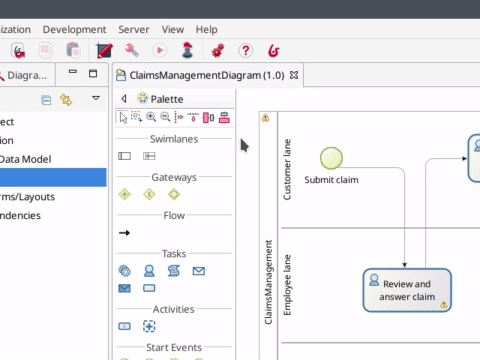
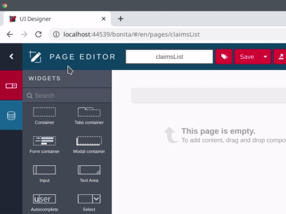
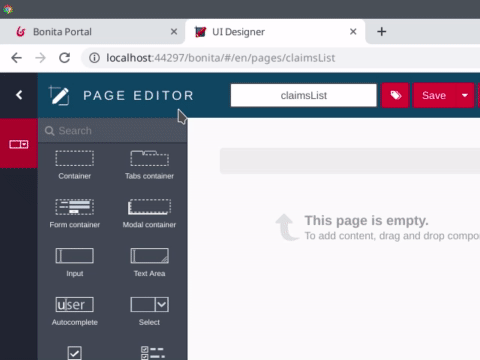

# Concevoir une page d'application

Jusqu'ici, avec un processus, des données, des formulaires et des connecteurs, nous avons construit une solution logicielle entièrement fonctionnelle pour gérer les réclamations. Mais que se passe-t-il si nous souhaitons avoir un tableau de bord affichant toutes les réclamations en cours ? Ce type de tableau de bord n'est pas un processus. Vous n'avez pas besoin de le « lancer » pour l'afficher. Une application Bonita apporte la solution. Et la première étape pour construire une application est de créer des pages.

::: info
Les pages dans Bonita ressemblent beaucoup à des formulaires. Elles sont créées à l'aide de l'éditeur d'interface utilisateur (UI Designer) avec les mêmes ensembles de widgets. La principale différence est qu'elles ne sont pas liées à une définition de processus (comme les formulaires d'instanciation et les formulaires de tâches utilisateur). Une page d'application peut afficher les valeurs des données métier, les graphiques et même permettre à l'utilisateur de lancer un processus ou d'exécuter une tâche en affichant le formulaire approprié.
:::

Pour cet exemple, nous construirons une page de base qui affiche toutes les réclamations soumises dans un tableau. Pour créer une nouvelle page :
1. Cliquez sur l'icône **UI Designer**  dans la barre d'outils de Studio
1. Ignorez la fenêtre contextuelle avec le message d'information
1. Cliquez sur le bouton **create**
1. Vérifiez que **Application page** est coché
1. Saisissez le nom : _claimsList_
1. Cliquez sur le bouton **Create**

   <!--{.img-responsive .img-thumbnail}-->

Sur la nouvelle page, vous pouvez permettre à UI Designer de créer automatiquement des variables pour récupérer les données métier :
1. Dans l'angle supérieur gauche de UI Designer, cliquez sur le bouton **data model** 
1. Dans la liste des objets métier, sélectionnez l'objet _Claim_ et glissez-déposez-le dans l'espace vide sur la page
1. Dans la fenêtre contextuelle, modifiez **Variable name** de _claim_ en _claims_
1. Dans la section **Additionnal queries**, sélectionnez _find_
1. Cliquez sur le bouton **Save**

   <!--{.img-responsive .img-thumbnail}-->

Ajouter et configurer le widget table :
1. Depuis la palette des widgets à gauche, glissez-déposez un widget **Table** sur le tableau blanc
1. Dans les propriétés du widget à droite :
   - Définissez le nom **headers** sur : _Description, Answer, Satisfaction level_
   - Pour le **content**, cliquez sur le bouton **fx**
   - Saisissez la valeur _claims_
   - Définissez **Column keys** sur : _description, answer, satisfactionLevel_
1. Cliquez sur le bouton **Save** de l'éditeur d'interface utilisateur
1. Cliquez sur le bouton **Preview** pour avoir un aperçu de votre page

   <!--{.img-responsive .img-thumbnail}-->

::: warning
Afin que l'aperçu accède aux données, un utilisateur doit être connecté au Portail Bonita. Vous pouvez cliquer sur le bouton **Portal** dans la barre d'outils de Bonita Studio pour vérifier qu'un utilisateur est connecté.
:::

Vous avez maintenant votre première page d'application. Il est temps de passer au [chapitre suivant](create-application.md) et de créer l'[application](create-application.md) qui intégrera la page.
