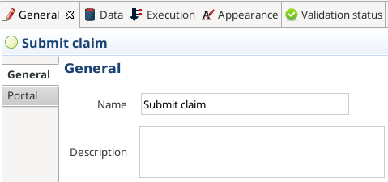

# Commencer à créer votre application : créer un diagramme de processus BPMN

Votre environnement de développement (c'est-à-dire Bonita Studio) est prêt à fonctionner, vous pouvez commencer à créer votre première Living Application Bonita.

Dans ce tutoriel, nous allons créer une solution de gestion des réclamations. S'assurer que les réclamations sont traitées et reçoivent une réponse rapide de ou des employés approprié(s) peut être capital pour la satisfaction des clients. C'est également un bon exemple d'application basée sur des processus qui utilise l'automatisation. Nous allons bien sûr simplifier à l'extrême l'application dans ce tutoriel pour vous permettre d'en apprendre plus sur Bonita et pas sur la gestion des réclamations !

Voici un aperçu de l'exécution du processus :
- Le processus sera démarré par un client qui soumet une réclamation, qui est une simple description sous forme d'un court texte dans notre exemple
- Ensuite, un employé examinera la réclamation et apportera une réponse
- Le client pourra examiner la réponse de l'employé et donner une note de satisfaction
- Si la note est égale ou supérieure à 3, le processus se terminera une fois que le client a lu la réponse
- Si la note est inférieure à 3, une tâche supplémentaire sera affectée au responsable de l'employé qui travaille avec ce client qui n'est pas vraiment satisfait. Une fois cette tâche effectuée, le processus sera terminé

> ℹ info :  
> Pour concevoir ce processus, nous utiliserons la Business Process Model and Notation (BPMN) standard. Vous n'avez pas besoin de tout connaître sur BPMN pour suivre ce tutoriel. Toutefois, si vous souhaitez en savoir plus, vous pouvez lire le [Ultimate Guide to BPMN 2.0](https://www.bonitasoft.com/library/ultimate-guide-bpmn).

> ⚠ avertissement ⚠ :  
> Nous utiliserons une approche itérative dans le développement du processus. Cela signifie que la première itération comportera quelques limitations :
> - un utilisateur unique exécutera toutes les tâches
> - nous ne collecterons pas de données soumises par l'utilisateur
> - le processus suivra un chemin unique : celui d'un client insatisfait
> 
> Lorsque nous introduisons des données dans notre définition de processus et que nous configurons des acteurs, un utilisateur pourra saisir des données dans les formulaires web, le processus suivra les chemins qui dépendent des valeurs des données, et différents utilisateurs seront impliqués.

## Créer le diagramme de processus

Créer un nouveau diagramme :
1. Dans le menu Bonita Studio, cliquez sur **Fichier > Nouveau diagramme**.

   <!--{.img-responsive .img-thumbnail}-->

Le nouveau diagramme comprend :
- Un pool : une définition de processus
- Une lane dans le pool : le nom par défaut de la lane est _Employé (lane)_ (nous aborderons les lanes dans un autre chapitre)
- Un événement de début : le point de départ de l'exécution du processus
- Une tâche utilisateur : une tâche (ou étape) qui doit être effectuée par un utilisateur

et il doit ressembler à la figure suivante :

Avant de continuer, renommons le diagramme et le pool :
1. Dans **Explorateur** à gauche de la fenêtre de Bonita Studio, sélectionnez le diagramme _MonDiagramme-1.0.proc_
1. Cliquez avec le bouton droit et sélectionnez **Renommer...**

   

1. Dans la fenêtre contextuelle, saisissez le nouveau nom du diagramme : _ClaimsManagementDiagram_, et pour le pool : _ClaimsManagement_

   

À présent, renommons l'événement de début (c'est-à-dire le disque vert à gauche du processus) :
1. Sélectionnez l'événement de début dans le diagramme
1. En bas de l'écran de Bonita Studio, allez dans l'onglet **Général > Général**
1. Modifiez l'attribut **Nom** et définissez la valeur : _Submit claim_

   

Renommons également la tâche utilisateur par défaut :
1. Sélectionnez la tâche utilisateur _Étape1_
1. En bas de l'écran de Bonita Studio, allez dans l'onglet **Général > Général**
1. Modifiez l'attribut **Nom** et définissez la valeur : _Review and answer claim_

À présent, nous ajoutons une autre tâche au processus :
1. Sélectionnez la tâche _Review and answer claim_ 
1. Au bord de la tâche sélectionnée, cliquez sur l'icône de tâche et déplacez-la sur le diagramme par glisser-déposer
1. Vérifiez que la nouvelle tâche ajoutée est sélectionnée
1. Cliquez sur l'icône boîte à outils
1. Sélectionnez l'icône utilisateur
1. Renommez la tâche en : _Read the answer and rate it_

   

Afin de définir un autre chemin dans notre exécution de processus, nous ajouterons une porte exclusive. Cette porte dirigera l'exécution du processus vers un chemin différent basé sur certaines conditions. Pour ajouter une porte exclusive, on procède de la même manière que pour ajouter une tâche :
1. Sélectionnez la tâche utilisateur _Read the answer and rate it_
1. Glissez-déposez l'icône de la porte en forme de losange
1. Cliquez sur l'icône boîte à outils
1. Modifiez le type de porte de parallèle (celle avec le signe **+**) en exclusive (celle avec le signe **x**)

   

1. Renommez la porte en : _Satisfaction level_

À partir de la porte, deux chemins sont possibles. Le premier termine le processus si le niveau de satisfaction du client est bon. La fin d'un processus est identifié par un événement de fin, un disque rouge. Pour ajouter un événement de fin, procédez de la même manière que pour l'ajout d'une tâche et d'une porte : 
1. Sélectionnez la porte
1. Glissez-déposez l'icône de l'événement (le disque)
1. Sélectionnez le type événement de fin (icône du disque rouge)

   

1. Renommez l'événement en : _End client satisfied_

Le second chemin à partir de la porte conduira à une autre tâche utilisateur :
1. Sélectionnez la porte _Satisfaction level_
1. Glissez-déposez l'icône de la tâche
1. Cliquez sur l'icône boîte à outils
1. Sélectionnez l'icône utilisateur
1. Renommez la tâche _Deal with unsatisfied customer_

À partir de cette tâche _Deal with unsatisfied customer_ nous devons aller vers un deuxième événement de fin :
1. Sélectionnez la tâche utilisateur _Deal with unsatisfied customer_
1. Glissez-déposez l'icône de l'événement (le disque)
1. Sélectionnez le type événement de fin (icône du disque rouge)
1. Renommez l'événement en : _End client unsatisfied_
1. Rafraîchissez la validation du diagramme : en bas de l'écran, sélectionnez l'onglet **Statut de validation** et cliquez sur le bouton **Rafraîchir**

Votre diagramme de processus doit ressembler à la figure suivante :

> ℹ info :  
> À présent, vous pouvez voir une erreur de validation sur la porte. L'erreur s'affiche parce que nous n'avons pas défini les conditions de l'exécution du processus lorsqu'il atteint la porte. L'exécution du processus échouera, parce que le moteur d'exécution du processus ne peut pas déterminer quel chemin suivre.

Nous devons configurer les conditions requises pour définir le chemin à suivre lors de l'exécution du processus. Les conditions sont définies sur les transitions sortantes de la porte (c'est-à-dire les flèches qui partent de la porte) :
1. Sélectionnez la transition qui va vers l'événement de fin
1. Nommez-la _Good_
1. Allez dans l'onglet **Général > Général**
1. Cochez la case **Flux par défaut**
   
   

> ℹ info :  
> **Flux par défaut** signifie que la transition sera activée uniquement si toutes les autres conditions configurées sur les transitions sortantes de la porte sont _false_ (valeur booléenne).

Nous devons configurer la condition sur la transition à partir de la porte vers la tâche _Deal with unsatisfied customer_ :
1. Sélectionnez la transition allant dans la tâche _Deal with unsatisfied customer_
1. Nommez la transition _Bad_
1. Allez dans l'onglet **Général > Général**
1. Dans **Condition**, saisissez la valeur _true_
1. Dans le menu Bonita Studio, cliquez sur **Fichier > Enregistrer**

> ⚠ avertissement ⚠ :  
> En raison de la valeur statique _true_, cette version du processus passera toujours par la tâche _Deal with unsatisfied customer_.

> ℹ info :
> Pour supprimer l'erreur, rafraîchissez la validation du diagramme : en bas de l'écran, sélectionnez l'onglet **Statut de validation** et cliquez sur le bouton **Rafraîchir**. Vous devez avoir 5 avertissements restants.

Félicitations ! Vous avez maintenant votre premier diagramme de processus BPMN valide !

## Exécuter votre processus

Vous pouvez maintenant compiler, packager, déployer et exécuter facilement cette définition de processus dans l'environnement de test intégré au Studio Bonita :
1. Sélectionnez le pool de processus, c'est-à-dire le rectangle qui inclut les événements de début et les tâches
1. Cliquez sur le bouton **Lancer**  dans la barre d'outils en haut de la fenêtre de Bonita Studio
1. Dans le formulaire d'instanciation, cliquez sur le bouton **Démarrer**. L'instance de processus est lancée et vous êtes redirigé(e) vers la liste des tâches du Portail Bonita
1. Déplacez votre souris sur le formulaire _Review and answer claim_ à droite du Portail Bonita et cliquez sur le bouton **Prendre** pour « réclamer » la tâche
1. Cliquez sur le bouton **Exécuter** pour exécuter réellement la tâche et faire avancer l'exécution du processus
1. Cliquez sur le bouton **Rafraîchir**  en haut de la liste des tâches pour la mettre à jour
1. Cliquez sur l'onglet **Synthèse** à droite pour voir le formulaire d'aperçu de l'exécution du processus avec des informations sur l'exécution du processus
1. Cliquez sur l'onglet **Formulaire** pour retourner dans le formulaire de la tâche utilisateur _Read the answer and rate it_ 
1. Vous pouvez cliquer sur **Prendre** et exécuter les deux tâches, _Read the answer and rate it_ et _Deal with unsatisfied customer_, pour terminer l'exécution du processus
1. Dans le menu supérieur du Portail Bonita, cliquez sur **Cas** 
1. Cliquez sur l'onglet **Cas archivés**
1. Cliquez sur l'action **Afficher la page de synthèse du cas** (c'est-à-dire l'icône « œil ») pour afficher le formulaire d'aperçu avec les informations sur l'exécution du processus
   
   <!--{.img-responsive .img-thumbnail}-->

> ℹ info :  
> Lorsque vous cliquez sur le bouton **Lancer**, la définition du processus et ses dépendances sont construites, intégrées et déployées dans l'environnement de test de Bonita Studio. Un utilisateur est connecté par défaut (nom d'utilisateur : _walter.bates_, mot de passe : _bpm_) et le formulaire de début généré automatiquement pour le processus est ouvert dans votre navigateur web. Si vous soumettez le formulaire d'instanciation, il lancera une nouvelle instance du processus (ou cas) et chargera la liste des tâches utilisateur dans le Portail Bonita. Dans la liste des tâches, vous ne pouvez pas immédiatement soumettre une tâche utilisateur, car, par défaut, tous les utilisateurs (de l'organisation test) sont des candidats pour exécuter les tâches du processus. Pour agir sur la tâche, vous devez d'abord la « réclamer », vous êtes alors le/la seul(e), parmi tous les candidats possibles, à pouvoir exécuter une action sur cette tâche.
 
> ℹ info :  
> Vous pouvez afficher les informations sur l'instance du processus dans la section [**Cas**](https://documentation.bonitasoft.com/bonita//cases) du Portail Bonita. Vous pouvez alterner entre **Cas démarrés** et **Cas archivés** pour voir les instances du processus en cours ou celles qui sont terminées. Notez que si vous souhaitez lancer un deuxième cas (c'est-à-dire une instance de processus), vous devez aller dans le menu **Processus** du Portail Bonita et cliquer sur le bouton **Démarrer un nouveau cas** (c'est-à-dire l'icône « lire » dans la colonne **Action**) à côté du nom de la définition de processus. Si vous cliquez sur le bouton **Lancer** à partir de Bonita Studio, vous nettoierez/écraserez toutes les informations liées à tous les processus avec un nom et une version identiques, y compris les cas précédents. Notez que si vous avez apporté des modifications à votre projet, vous souhaitez probablement cliquer sur le bouton **Lancer** pour être certain(e) que la dernière version est déployée.

Vous avez construit et exécuté avec succès votre premier processus. Jusqu'ici, il n'est pas très utile car il ne traite pas de données, n'inclus pas de formulaires web et comprend un seul bouton soumettre. Dans les chapitres suivants, nous [définirons un modèle de données métier](define-business-data-model.md) et nous l'associerons au processus pour enregistrer des informations liées à la réclamation soumise par l'utilisateur.
