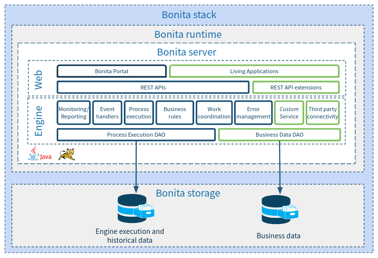

# Qu'est-ce que Bonita ?

Bienvenue dans ce tutoriel de démarrage Bonita. Cette page vous donnera un aperçu rapide de ce que vous pouvez faire avec Bonita et vous présentera l'architecture de Bonita.

Si vous êtes impatient(e) de commencer à créer votre première application avec Bonita, vous pouvez ignorer cette page et passer directement au [téléchargement et à l'installation](bonita-studio-download-installation.md) de Bonita Studio.

## Que puis-je faire avec Bonita ?

Bonita est une plate-forme d'automatisation des processus métiers (Digital Process Automation : DPA) qui vous permet de créer des applications basées sur des processus. Les processus peuvent être partiellement automatisés (si des utilisateurs sont impliqués) ou entièrement automatisés.

Le DPA, disponible avec toutes les éditions de Bonita, s'applique à une vaste palette de cas d'utilisation : les applications peuvent inclure entre autres la gestion des demandes de prêts, les processus d'inscription des étudiants d'une université ou encore les processus d'analyse dans la découverte de médicaments ! Vous trouverez les différents secteurs dans lesquels Bonita est utilisé ainsi que les cas d'utilisation sur notre [page dédiée sur le site web](https://fr.bonitasoft.com/industries).

À partir de Bonita 7.10, vous pouvez également traiter la gestion adaptative des cas (Adaptive Case Management) avec Bonita. 
ACM (Adaptive Case Management) est similaire au DPA dans le sens où elle permet de traiter des cas avec une certaine automatisation. Cependant, elle s'appuie également sur des principes forts qui la différencie de la DPA : 
  - Donner le pouvoir aux acteurs : les acteurs responsables du cas ont une certaine autonomie pour aboutir à la clôture du cas : tous les chemins du processus ne sont pas prédéterminés. Certaines tâches sont facultatives, d'autres sont discrétionnaires. Les connaissances spécifiques des acteurs leur permettent de choisir l'action suivante appropriée pour un cas. 
  - S'attendre à l'inattendu : un cas peut être arrêté, repris et peut même modifier son état à tout moment sans avoir prédéfini de chemin. Il peut être nécessaire de créer de nouvelles tâches à la volée pour refléter la spécificité d'un cas tout en bénéficiant de la traçabilité.
  - S'adapter au contexte : le type et l'état du cas définissent la disponibilité des tâches selon un ensemble de règles métier. Ces règles doivent être modifiables à la volée.
  - Centrer sur les données : l'exécution du cas n'est pas centrée sur un processus strict, mais sur les données du cas pour créer et mettre à jour.

ACM est disponible dans les éditions Teamwork, Efficiency, Performance et Enterprise de Bonita.

Pour savoir comment utiliser les fonctionnalités d'ACM dans Bonita, consultez la [documentation](https://documentation.bonitasoft.com/bonita//use-bonita-acm).

## Comment créer une application Bonita ?

Grâce à la plate-forme low code Bonita, vous n'aurez pas besoin d'écrire beaucoup de code pour créer une application. La création d'applications Bonita s'appuie largement sur des modèles : un modèle de processus (utilisant le standard BPMN), un modèle de données pour la gestion des données métier, un outil WYSIWYG pour la conception de l'interface utilisateur...

Pour créer une application dans Bonita Studio (l'environnement de développement de Bonita), vous devez suivre les étapes suivantes :
- concevoir graphiquement un ou plusieurs processus en utilisant la notation BPMN
- définir le modèle de données en utilisant la fonctionnalité de gestion des données métier de Bonita (vous pouvez bien sûr utiliser votre propre base de données si nécessaire)
- créer des interfaces utilisateur web en utilisant l'éditeur d'interface utilisateur de Bonita (ou votre framework web favori)
- définir les utilisateurs impliqués dans le processus
- configurer des connecteurs pour intégrer Bonita au système d'information (par exemple, envoyer un e-mail, appeler un web service, etc.)

Nous aborderons ces étapes dans ce tutoriel de démarrage afin de vous familiariser avec les concepts d'une application Bonita.

## Présentation de l'architecture de la solution Bonita

### Bonita Studio

<!--{.img-responsive .img-thumbnail}-->

Bonita Studio vous fournit tout ce dont vous avez besoin pour développer et construire une application Bonita. Bonita Studio est une application de bureau construite sur Eclipse.

Elle fournit :
- des fonctionnalités pour modéliser les processus BPMN (Business Process Modeling Notation)
- des fonctionnalités pour modéliser le BDM (Business Data Model)
- des fonctionnalités pour modéliser les interfaces utilisateur (UI Designer)
- des fonctionnalités pour modéliser les applications
- un serveur Bonita intégré (décrit ci-dessous), exclusivement dédiée aux tests de l'application effectués en local par le développeur de l'application.

Bonita Studio n'est pas prévu pour un autre usage que le développement. Par conséquent, la stack Bonita intégrée dans Bonita Studio ne peut pas être utilisée à des fins de production.

### Stack, runtime et serveur Bonita

<!--{.img-responsive .img-thumbnail}-->

La « stack Bonita » désigne tous les composants dont vous avez besoin pour déployer et mettre les applications à disposition des utilisateurs finaux en production. Elle inclut Bonita runtime et deux schémas de base de données (un pour le moteur Bonita et un pour les données métier).

Bonita runtime inclut un serveur Bonita unique dans la Bonita Community Edition. Dans l'Enterprise Edition, Bonita runtime peut comprendre plusieurs serveurs Bonita pour créer un cluster pour une haute performance et une haute disponibilité.

Le serveur Bonita a deux composants : le moteur Bonita qui gère l'exécution des processus et le portail web qui fournit les interfaces web pour les utilisateurs finaux et les administrateurs.

Le serveur Bonita est une application Java autonome exécutée sur un serveur d'application Java installé sur un hôte (une machine, une machine virtuelle, une instance de cloud, un conteneur comme Docker...).

Maintenant que vous avez une image globale de Bonita, vous êtes prêt(e) à passer à l'étape suivante : [télécharger et installer Bonita Studio](bonita-studio-download-installation.md).
